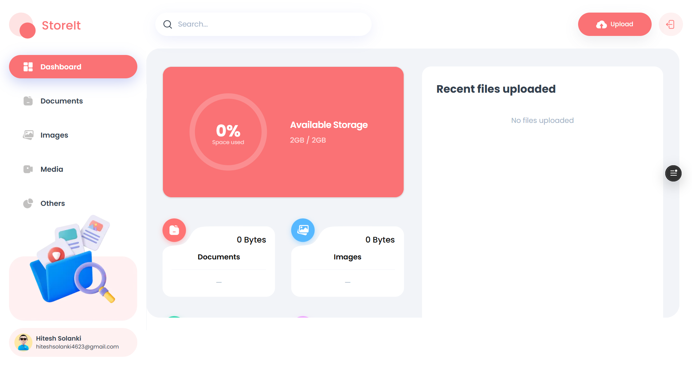

# 📁 StoreIt – Cloud File Storage App

**Drive Clone** is a cloud-based file storage application that emulates the core functionalities of Google Drive. Built with modern web technologies, it allows users to upload, manage, and access their files securely from anywhere.

🔗 **Live Demo:** [https://drive-clone-seven.vercel.app](https://drive-clone-seven.vercel.app)

---

## 🚀 Features

- **File Upload:** Upload files of various formats securely to the cloud.
- **File Management:** Organize, view, and manage your uploaded files.
- **Responsive Design:** Optimized for both desktop and mobile devices.
- **Secure Storage:** Files are stored securely using Appwrite's storage services.

---

## 🛠️ Tech Stack

**Frontend:**

- Next.js
- TypeScript
- Tailwind CSS
- ShadCN UI

**Backend & Services:**

- Appwrite (Cloud Storage)

**Deployment:**

- Vercel

---

## 📸 Screenshots

### File Management Dashboard



---

## 🧰 Getting Started

### Prerequisites

- Node.js (v18 or higher)
- npm or yarn
- Appwrite account for storage services

### Installation

1. **Clone the repository:**

   ```bash
   git clone https://github.com/Hitesh-s0lanki/drive-clone.git
   cd drive-clone
   ```

2. **Install dependencies:**

   ```bash
   npm install
   # or
   yarn install
   ```

3. **Set up environment variables:**

   - Create a `.env.local` file in the root directory.
   - Refer to `.env.example` for the required environment variables.

4. **Run the development server:**

   ```bash
   npm run dev
   # or
   yarn dev
   ```

   Open [http://localhost:3000](http://localhost:3000) with your browser to see the result.

---

## ☁️ Deployment

The application is deployed on [Vercel](https://vercel.com), offering seamless integration with GitHub for continuous deployment. Every push to the `main` branch triggers an automatic deployment.

---

## 🔮 Future Enhancements

- **User Authentication:** Implement secure user login and registration.
- **Folder Management:** Allow users to create and manage folders.
- **File Sharing:** Enable sharing of files with other users.
- **Search Functionality:** Implement search to quickly find files.

---

## 🤝 Contributing

Contributions are welcome! Please fork the repository and submit a pull request for any enhancements or bug fixes. For major changes, please open an issue first to discuss what you would like to change.

---
